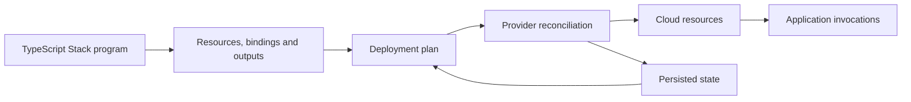

# Alchemy

Alchemy is a TypeScript infrastructure-as-code framework. Its v2 resource model uses Effect to describe cloud objects, their dependencies and the work needed to reconcile them. A deployment program produces a desired resource graph; providers translate that graph into cloud API operations, while a state store records identity, configuration and outputs between deployments. Alchemy also offers **Infrastructure as Effects**, which connects application capabilities to deployment-time permissions and configuration. [What is Alchemy?](https://alchemy.run/what-is-alchemy/), [Infrastructure as Effects](https://alchemy.run/infrastructure-as-effects/)

These articles describe **Alchemy `2.0.0-beta.79` with Effect `4.0.0-rc.117`**. This is a versioned reference, not a floating latest-release recommendation. Alchemy's Effect peer range is open-ended, so it admits later RCs without proving they work; Effect RCs rename public APIs. Read [version-specific traps](version-specific-traps.md) before combining releases or copying newer examples.

## Infrastructure and application execution

A resource declaration describes an object such as a queue, database table or function. Yielding that declaration within a Stack registers it with the deployment graph. It does not mean that every resource operation has already completed. Attributes such as an ARN can remain unresolved until reconciliation. Passing those attributes to another resource establishes dependency information; manually constructing a guessed ARN loses that relationship.

Application execution is a separate lifetime. A Lambda handler may use an AWS capability obtained through a binding, but creating the infrastructure is not itself a request handler. An Alchemy runtime constructor is evaluated during infrastructure discovery and again during runtime initialization. Request-specific reads and external writes belong inside the returned handler. This phase distinction explains why sending a message while constructing a service can perform work at an unintended time. [Resources](https://alchemy.run/infrastructure-as-code/resource/), [Phases](https://alchemy.run/infrastructure-as-effects/phases/)

The diagram describes responsibilities, not an atomic transaction. A deployment may change several cloud objects before a later operation fails. State is essential recovery information, and cloud observations can differ from the last saved record.

## Core vocabulary

| Concept | Meaning | Detailed article |
| --- | --- | --- |
| Stack | Named composition of infrastructure, providers, state and outputs | [Stacks, resources and actions](model.md) |
| Resource | Logical identity, desired inputs, observed attributes and provider lifecycle | [Lifecycle and providers](lifecycle-and-providers.md) |
| Action | Deployment work whose resolved inputs determine reuse of a saved result | [Resource versus Action](model.md#actions) |
| Output | Deferred value with dependency information | [Outputs and references](outputs-and-references.md) |
| Reference | Read of another persisted resource or Stack output without taking ownership | [Cross-stack references](outputs-and-references.md#cross-stack-and-cross-stage-references) |
| Binding | Capability contract and implementation that connect runtime access with deployment requirements | [Runtime and bindings](runtime-and-bindings.md) |
| Event source / Sink | Runtime trigger adapter / stream consumer for a destination | [Event sources and sinks](events-and-sinks.md) |
| Stage / Profile | Deployment instance / credential selection; neither alone defines the cloud account boundary | [Environments and state](environments-and-state.md) |

Providers cover multiple cloud platforms. Provider availability does not imply identical semantics: an AWS SQS adapter and a Cloudflare Queue adapter have different acknowledgement, retry and runtime contracts. The AWS articles in this knowledge base explain the underlying service behavior independently of Alchemy.

## Working with Alchemy

Start by declaring a small Stack and choosing its state backend explicitly. Check its output and resource identities with a plan, then apply the desired state using the CLI. Keep the same stage and state location across subsequent runs. Adding a resource, changing its props, changing its logical ID and removing its declaration are four different changes with different lifecycle consequences. [CLI and deployment workflow](cli-and-deployment.md)

Use native resources and runtime capabilities when they expose the needed behavior. Inspect the concrete adapter when correctness depends on acknowledgement or retry semantics. For example, beta.79's convenience SQS consumer does not return record-level failures, and its generic queue sink can drop permanently rejected entries. The type system describes the API contract; it cannot make a remote service exactly-once or supply a missing adapter implementation.

For repeatable dependencies, pin the package set and commit its lockfile. Validate runtime imports as well as TypeScript declarations. For repeatable infrastructure, keep logical identities stable and make ownership explicit. For recoverable operations, distinguish deployment state from application records, backups and event histories. These address different failure modes.

## Documentation for agents and further reading

Alchemy publishes a [guide and concept index at `llms.txt`](https://alchemy.run/llms.txt). Its [larger `llms-full.txt` index](https://alchemy.run/llms-full.txt) additionally lists generated per-resource API reference pages. **Both are navigation indexes**, according to the maintained generator; do not assume the `full` file contains all article bodies. Select a relevant entry and retrieve its target page. [Published index source](https://github.com/alchemy-run/alchemy/blob/main/website/public/llms.txt), [index generator](https://github.com/alchemy-run/alchemy/blob/main/website/scripts/generate-llms-txt.ts)

If the public documentation site cannot be fetched, retrieve the index, generator and Markdown articles from the official repository. For beta-specific behavior, the [published beta.79 package source](https://unpkg.com/alchemy@2.0.0-beta.79/package.json) takes precedence over an unversioned guide. Its `src` directory contains providers and runtime adapters. Documentation indexes aid discovery; they are not compatibility declarations.

The remaining detailed articles cover [state and credentials](environments-and-state.md), [safe renaming and custom providers](lifecycle-and-providers.md), [Layers and runtime scope](runtime-and-bindings.md), [AWS domains and HTTP resources](aws-domains-and-http.md), and [documented implementation mismatches](version-specific-traps.md). For Effect itself, begin with [Effect](../effect/effect.md); for account, service and permission fundamentals, begin with [AWS](../aws/aws.md).
