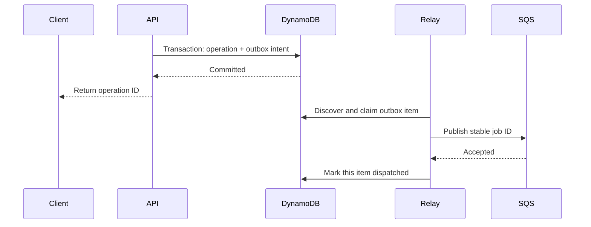

# Transactions, streams, and the outbox

[AWS](aws.md)

## The dual-write problem

Writing an application record and then sending an SQS message leaves a crash window between the operations. The API might acknowledge a database record that no worker ever sees. Reversing the operations allows a worker to see work that the database never committed. DynamoDB and SQS do not participate in one shared transaction. [AWS transactional outbox guidance](https://docs.aws.amazon.com/prescriptive-guidance/latest/cloud-design-patterns/transactional-outbox.html)

The transactional outbox pattern atomically persists a domain transition and an outbox item in DynamoDB. A relay publishes that intent to SQS and marks it dispatched after its individual publication succeeds. If publication succeeds but marking fails, the relay publishes again: duplicate handling remains required.



An SQS notification is a wake-up signal for a durable intent; the worker validates the authoritative record.

## Transaction constraints

`TransactWriteItems` supports up to 100 distinct item actions and 4 MB total in one account/Region. It cannot target one item twice in the same transaction: put a condition on an Update rather than adding a ConditionCheck for the same item. Use transactions for small atomic invariants, not an unbounded bulk operation. [Transaction APIs](https://docs.aws.amazon.com/amazondynamodb/latest/developerguide/transaction-apis.html)

The optional client request token provides a 10-minute transaction idempotency window. It is not a long-lived API idempotency record. For longer-lived API deduplication, persist a caller-scoped key, canonical request fingerprint and original operation result for the required application horizon. The same key with a different payload must conflict; the same payload must recover the original operation. A token is also a window over **one** request, so an operation that spans several transactions cannot share one: the later transactions differ in content and are rejected as a mismatch rather than deduplicated. A cascade built only from deletes is already idempotent and needs no token.

**A transaction built from a query page needs an explicit page bound.** A DynamoDB query page defaults to 1 MB, which is hundreds of small items, so a cascade that turns "one page" into "one transaction" silently exceeds 100 actions as soon as the entity grows. That failure is not transient: it fails identically on every retry, and the entity becomes permanently undeletable. Set the page `Limit` from the arithmetic — actions per item, plus whatever the transaction adds for the parent — and treat the number as load-bearing rather than as tuning.

**Do not both update and delete the same item in one cascade transaction.** Deleting a parent while also bumping its counter violates the distinct-item constraint. The unchanged request will keep failing; retrying cannot repair its shape. The AWS API reference lists duplicate-item actions among the causes of `TransactionCanceledException`, so do not assume every cancellation is a business condition conflict. Classify available cancellation reasons and retain unclassified failures. Omit an obsolete counter update when deleting the parent; later operations can condition on the parent's existence. [TransactWriteItems errors](https://docs.aws.amazon.com/amazondynamodb/latest/APIReference/API_TransactWriteItems.html).

**Deleting the discoverable parent last makes a cascade resumable while the parent remains.** After `META` is deleted, transactional parent-existence checks prevent new dependents. They do not prevent a dependent from being added between the final discovery read and parent deletion. That interleaving can leave orphans, and retrying a delete that returns immediately for an absent parent will not remove them. A marker-free cascade is appropriate only when concurrent additions are excluded or that residual is explicitly accepted. If orphan-free deletion is required, close additions before draining, for example with a deleting state checked by every membership writer; define how reads and repeated deletes handle that state. [Transaction isolation boundaries](https://docs.aws.amazon.com/amazondynamodb/latest/developerguide/transaction-apis.html).

## Outbox relay choices

A DynamoDB Streams trigger offers prompt delivery of changes. Filter for new/eligible outbox records; updates made by the relay must not trigger publication loops. Streams retain records for 24 hours and preserve modification order for an individual item, not a global ordering across items. Consumers must handle duplicate processing. [DynamoDB Streams](https://docs.aws.amazon.com/amazondynamodb/latest/developerguide/Streams.html)

Keep the outbox item itself durable until publication is settled and retain a due-work recovery query. A periodic repair process finds undispatched intents if a stream consumer falls behind the retention window. Do not assume a short-lived stream is a permanent audit log or sole recovery source.

If the relay batches writes, inspect each SQS `Successful` and `Failed` entry, preserving the mapping to its outbox ID. Persist permanent rejection before considering it handled. Alchemy beta.77's generic queue sink can drop permanent failures, so use the [explicit publication boundary](../alchemy/events-and-sinks.md).

## Bounded fan-out

When one operation creates many child jobs, expand the input in bounded pages and persist continuation cursors. Derive stable child IDs so retrying a page does not create new logical work. Distinguish records discovered, jobs committed, notifications published and downstream processing completed; these counts represent different stages.

Define whether the input is a snapshot or a live query. A snapshot makes the original selection reproducible but does not override later authorization changes or cancellation. Consumers still validate whichever current-state conditions govern execution.

## Recovery invariant

Every accepted operation must end in a known terminal result or remain discoverable as pending, retryable, quarantined or ambiguous. “Message disappeared from the queue” is not a sufficient completion record. Restores and DLQ redrives must preserve the same logical IDs and authorization and state-transition rules.

## An atomic operation-and-intent write

The following low-level `TransactWriteItems` request illustrates creation of an operation and its publication intent. It assumes a composite-key table; names, IDs and the request token are examples:

```json
{
  "ClientRequestToken": "request-42",
  "TransactItems": [
    { "Put": {
      "TableName": "Operations",
      "Item": {
        "PK": { "S": "OP#42" }, "SK": { "S": "STATE" },
        "status": { "S": "pending" }
      },
      "ConditionExpression": "attribute_not_exists(PK)"
    } },
    { "Put": {
      "TableName": "Operations",
      "Item": {
        "PK": { "S": "OP#42" }, "SK": { "S": "OUTBOX#1" },
        "status": { "S": "pending" }, "jobId": { "S": "job-42" }
      },
      "ConditionExpression": "attribute_not_exists(PK)"
    } }
  ]
}
```

Both distinct items commit or neither does. On a repeated request outside the token's idempotency window, the conditions can fail because the operation already exists. Recover the original operation using its application idempotency record instead of generating another ID. Updating existing state would use an Update with its own version/state condition rather than this create-only Put example. [Transaction request semantics](https://docs.aws.amazon.com/amazondynamodb/latest/developerguide/transaction-apis.html)

## Diagnose the relay's crash windows

| Failure point | Durable state | Recovery behavior |
| --- | --- | --- |
| Before transaction commit | No acknowledged operation | Caller can retry under the same idempotency identity |
| After commit, before publication | Pending outbox intent | Relay or repair query discovers it |
| After publication, before dispatch marker | Destination may contain the message | Relay can duplicate it; consumer deduplication is required |
| After dispatch marker, before consumer success | Message accepted by transport | Consumer retry/redrive owns unfinished processing |

A relay lease must expire or be recoverable after a crash. The marker update should condition on the relay's ownership and source revision. A sweeper query needs an efficient access path to pending work; a full table scan is not a scalable substitute for a due-work index. Because that index can be stale, claim the authoritative base item conditionally.

The outbox solves recoverable publication, not arbitrary end-to-end exactly-once effects. For an external API without an idempotency token, a timeout after submission can still leave the final outcome uncertain. Preserve that uncertainty rather than automatically converting it into permission for a new operation.
