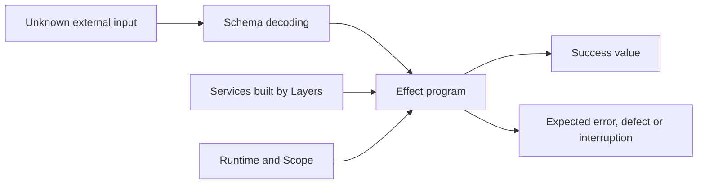

# Effect

Effect is a TypeScript library and runtime for describing computations with explicit success values, expected failures and required services. It combines asynchronous execution with structured concurrency, resource lifetimes, dependency construction, schemas, retries, streams and observability. These facilities let a program retain information that is often lost when every boundary is reduced to an untyped Promise rejection. [Effect introduction](https://effect.website/docs/v4/getting-started/why-effect/), [versioned Effect source](https://unpkg.com/effect@4.0.0-rc.117/src/Effect.ts)

The examples here target **Effect `4.0.0-rc.117`**, with matching companion packages where used. Effect 3 documentation and other v4 release candidates may use different module paths and constructors. In particular, RC117 uses `Context.Service`, `Schema.TaggedError` and PascalCase constructors such as `Config.String`, `Config.Redacted` and `Flag.Boolean`; examples written before RC113 use lowercase names that no longer exist. [Alchemy compatibility](../alchemy/version-specific-traps.md#effect-prerelease-compatibility)

## The computation model

`Effect.Effect<A, E, R>` is a description of a computation. `A` is the value produced on success, `E` is its expected error type, and `R` describes the services it needs. A computation returning `Effect<User, NotFound, Users>` can produce a user, report a known absence, and requires a `Users` implementation. `never` in the error position means no expected failures are declared; it does not mean defects or interruption are impossible. `never` in the requirement position means no additional services remain to be supplied.

Constructing an Effect usually does not execute it. `Effect.gen` provides sequential composition with `yield*`; combinators such as `map`, `flatMap`, `catchTag` and `provide` transform the description. A runner or hosting runtime eventually executes it. Keep runners at process or integration boundaries so intermediate functions retain their dependency and failure information. See [foundations](foundations.md) for constructors, failure recovery and Promise interoperation.

Schemas, Layers and Scope solve separate problems: what a value means, how a capability is constructed, and how long a resource lives. A schema cannot authorize a caller, a Layer cannot persist a business transaction, and a finalizer cannot run after every possible process failure.

## The major building blocks

| Building block | What it provides | What it does not provide |
| --- | --- | --- |
| Effect and typed errors | Composable work and explicit expected failure | Automatic correctness of external side effects |
| Context service | A named capability required by a computation | A database or independently deployed service |
| Layer | Dependency construction, composition and scoped acquisition | Automatic wiring between unrelated sibling Layers |
| Scope and fibers | Resource lifetime and structured concurrent execution | Durable work after a process disappears |
| Schema | Runtime validation and representation conversion | Ownership, authorization or remote existence checks |
| Schedule | Policy for repetition and retry timing | Persisted future execution after a restart |
| Stream, Sink, Queue, PubSub | Incremental processing and in-memory coordination | Cross-process message durability |
| HTTP, CLI and platform modules | Transport contracts and runtime adapters | One universal deployment or authentication model |

[Services and Layers](services-and-layers.md) explains construction and lifetime. [Schema and configuration](schema-and-config.md) covers decoding, encoding and startup settings. [Retries and concurrency](retries-and-concurrency.md) explains schedules, bounded execution and cancellation.

## Choosing an integration boundary

A small script can execute a fully provided Effect directly. A Node command generally uses `NodeRuntime.runMain` so process exit and interruption are managed at one boundary. A Promise-based server can use `ManagedRuntime` to share a Layer across callbacks. A host such as Alchemy can own runtime startup and invocation scopes, in which case starting another root runtime in every handler loses the host's intended lifecycle. [ManagedRuntime example](https://unpkg.com/effect@4.0.0-rc.117/ai-docs/src/04_integration/10_managed-runtime.ts)

Use Effect where explicit failure, cancellation, resource safety or dependency substitution is useful. Existing Promise APIs can be adapted incrementally; a wholesale rewrite is not required. Preserve an abort signal when the client supports it, classify errors at the boundary and remember that cancelling a network wait does not undo a remote write.

## HTTP, command-line programs and tests

Effect v4 groups HTTP contracts under `effect/unstable/httpapi`, lower-level HTTP capabilities under `effect/unstable/http`, and CLI parsing under `effect/unstable/cli`. A contract, its server implementation and its client share schemas while remaining separate runtime components. These paths are version-sensitive. The [HTTP, CLI and runtime article](http-cli-and-runtime.md) includes complete small examples and explains where platform Layers are needed.

Tests can provide deterministic service implementations without changing the calling code. Virtual time lets retry and timeout tests exercise long logical durations without real sleeping. Integration tests still need to verify remote consistency, permissions and actual host adapters. [Testing and observability](testing-and-observability.md) covers the RC117 test-runner peer range, `TestClock`, logging and tracing.

## Documentation exports and exact-version references

The root [`llms.txt`](https://effect.website/llms.txt) and [`llms-full.txt`](https://effect.website/llms-full.txt) URLs returned 404 through the documentation fetcher on 2026-09-11; direct requests were also blocked. Treat them as unconfirmed current entry points, not dependable RC117 references. Older external directories advertising these files are insufficient evidence that they remain available.

The maintained website instead generates **plain Markdown for v4 documentation** by appending `.md` to a page path, for example the [Why Effect Markdown endpoint](https://effect.website/docs/v4/getting-started/why-effect.md). The [official route implementation](https://github.com/Effect-TS/website/blob/main/apps/web/src/pages/docs/%5Bversion%5D/%5B...markdown%5D.ts) limits this export to v4 and generates it from the same content collection as the site. A v4 page can still reflect a later RC than the one installed.

For exact RC117 usage, consult the package's [first-party example catalog](https://unpkg.com/effect@4.0.0-rc.117/ai-docs/README.md), its individual examples and the relevant `src/<Module>.ts`. Check signatures and exported names there before applying a live-site migration example. For conceptual navigation, the articles here progress from [core computations](foundations.md) through [services](services-and-layers.md), [schemas](schema-and-config.md), [concurrency](retries-and-concurrency.md), [integration](http-cli-and-runtime.md) and [testing](testing-and-observability.md).
